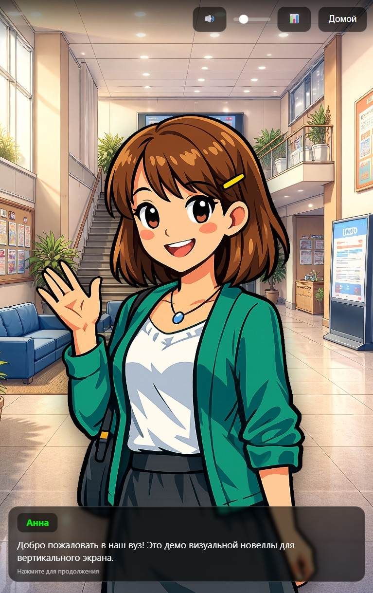
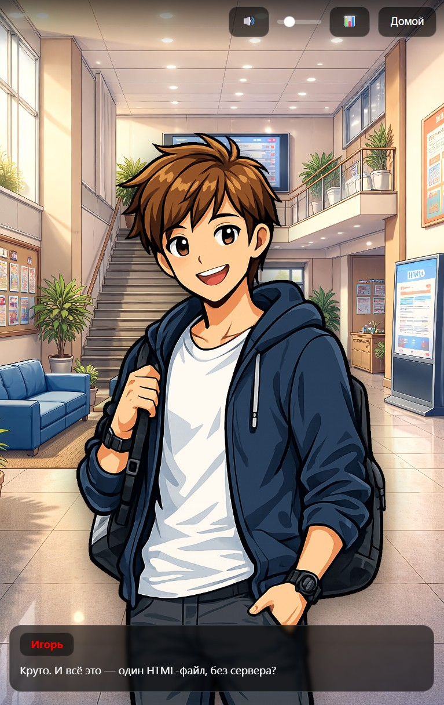
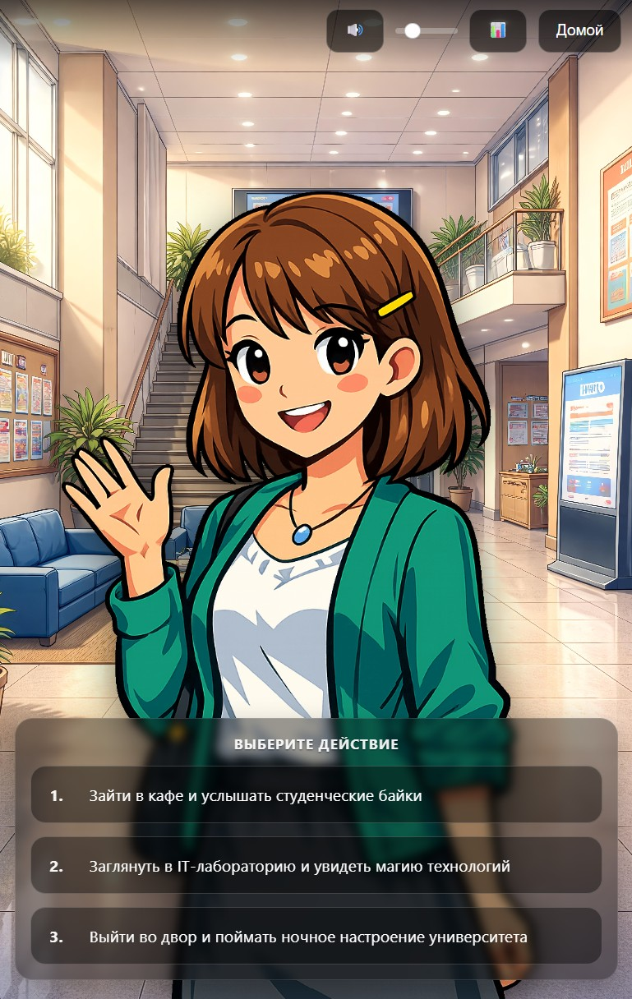
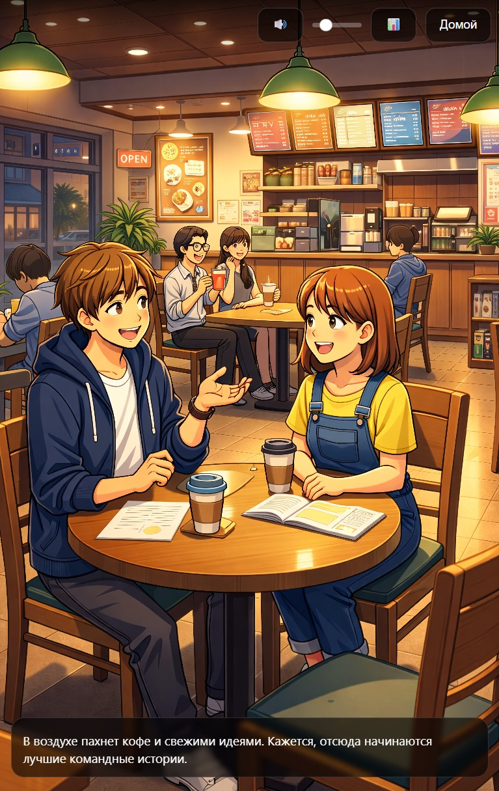
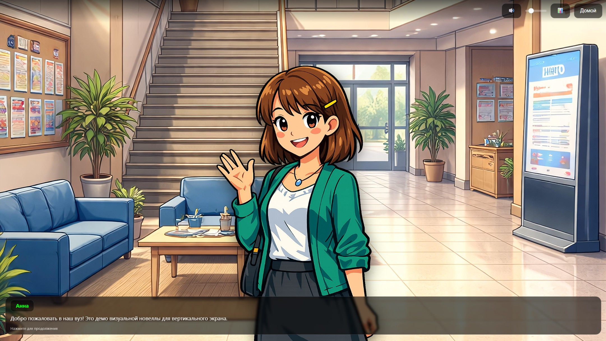
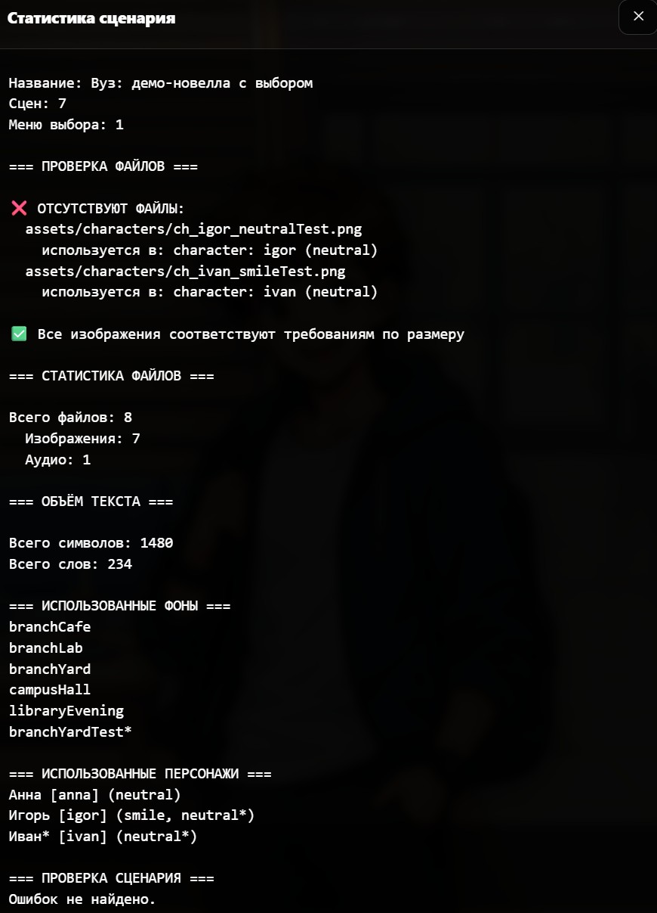
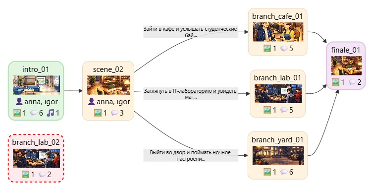
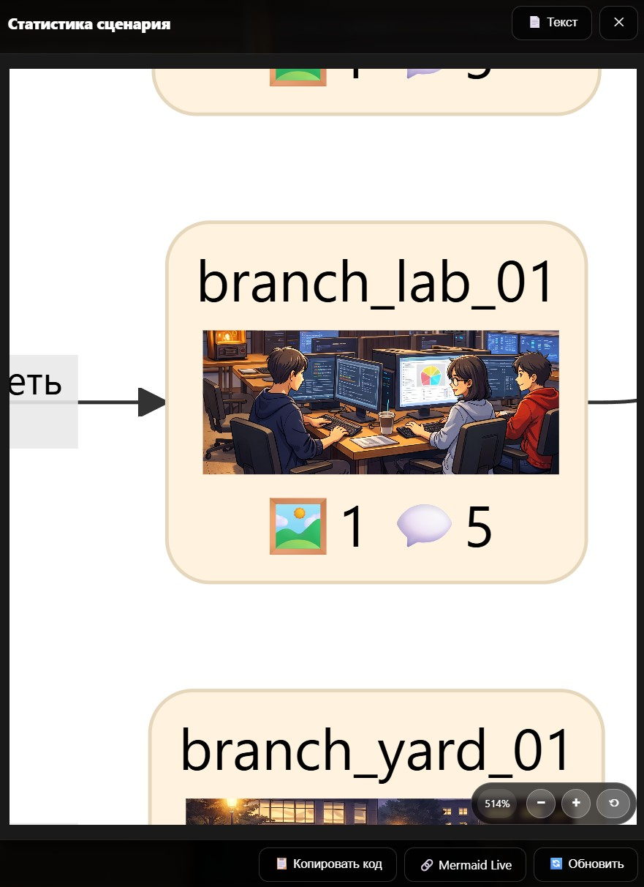

# 🎮 Visual Novel Vertical Engine

<p align="center">
  <strong>Lightweight HTML/CSS/JS visual novel engine built for vertical screens.</strong>
</p>

<p align="center">
  Offline • No build tools • Portrait-first • 4K vertical display ready
</p>

<p align="center">
  <a href="https://ilyabarilo.github.io/vn-vertical-engine/">
    
  </a>
</p>

<p align="center">
  <a href="https://github.com/IlyaBarilo/vn-vertical-engine/stargazers">
    
  </a>
  <a href="https://github.com/IlyaBarilo/vn-vertical-engine/blob/main/LICENSE">
    
  </a>
  <a href="https://github.com/IlyaBarilo/vn-vertical-engine/releases/latest">
    
  </a>
  <a href="https://github.com/IlyaBarilo/vn-vertical-engine/commits/main">
    
  </a>
  <a href="https://github.com/IlyaBarilo/vn-vertical-engine/releases/latest">
    
  </a>
  <a href="https://ilyabarilo.github.io/vn-vertical-engine/">
  
</a>
</p>


A lightweight **offline visual novel engine** built with HTML, CSS, and JavaScript.

Designed for **vertical screens**, **portrait displays**, and **real-world installations** — from kiosks to 4K TVs.

No setup. No dependencies. Just open `index.html` and start.

---

## ✨ Features

-   📱 UI optimized for **vertical screens**
-   🖥 optimized for **4K displays**
-   📐 interface ratio **7:16**, with support for other aspect ratios
-   🌐 **fully offline**
-   ⚡ no build tools or frameworks required
-   🧾 simple **text-based scripting format**
-   🖼 support for **backgrounds**
-   🎭 **characters and emotions**
-   💬 dialogue system
-   🔀 **branching storylines**
-   🎵 background music support
-   📊 built-in **resource loading statistics**
-   📘 **Specifications:** [Story scripting](SPEC-STORY.md), [Mini-games](SPEC-GAME.md)

---

## 📷 Demo

### 🖼️ Visual Novel Demo

<p align="center">




</p>

Also supports horizontal mode:

<p align="center">

</p>

---

### 📊 Analysis Tools

Script validation and graph generation in Mermaid format.

<p align="center">

</p>

Graph rendering inside the engine with navigation support. Useful for
debugging scripts and detecting unreachable nodes (marked in red).

<p align="center">


</p>

---

## 🧩 Use Cases

This engine is suitable for:
- interactive stories
- museum installations
- exhibition stands
- educational projects
- university interactive displays
- browser-based narrative games
- vertical information kiosks

---

## 📁 Project Structure

    project/
    │
    ├── index.html
    ├── story.js
    ├── README.md
    ├── LICENSE
    ├── NOTICE.md
    │
    ├── engine/
    │    ├── engine.css
    │    ├── engine.js
    │    └── story-loader.js
    │
    ├── docs/
    │    └── specs/
    │         ├── SPEC-STORY.md      ← scripting specification
    │         └── SPEC-GAME.md       ← mini-game specification
    │
    ├── lib/
    └── assets/
             ├── backgrounds/
             ├── characters/
             ├── audio/
             └── games/

---

## 🚀 Quick Start

1.  Download the latest version:

👉 **[Download Latest Release](https://github.com/IlyaBarilo/vn-vertical-engine/releases/latest)**

2.  Extract the archive.

3.  Open **index.html** in your browser.

The engine runs completely **offline**.

---

## 📏 Vertical Screen Adjustment

To add top and bottom margins (useful for floor-mounted displays), use
URL parameters:

    index.html?topSpacing=500&bottomSpacing=800

Replace `500` and `800` with your desired values (in pixels).

---

## 📝 Script Format

The script is stored in `story.js` as a text block.

Example:

``` javascript
window.STORY_TEXT = `

[meta]
title = Demo Story
startScene = intro
lang = en

[bg]
campusHall file=assets/backgrounds/bg-campus-hall.jpg

[char]
anna emotion=neutral file=assets/characters/ch-anna-neutral.png name="Анна" color=#0F0
anna emotion=smile file=assets/characters/ch-anna.png  # добавление эмоций персонажу anna
igor emotion=neutral file=assets/characters/ch-igor-neutral.png name="Игорь" color=#F00

igor name="Игорь" file=assets/characters/ch-igor-smile.png  # Если не указана эмоция, то считается neutral
igor color=#F00  # можно отдельно дополнять значения для персонажа

[audio]
bgmDay file=assets/audio/bgm-campus-day.mp3

[var]
resultGame = 0

[game]
gameCoffeeRush file=assets/games/coffee-rush.html

[scene]
scene intro

bg hall

show anna neutral

anna: "Welcome to the demo."

menu
"Go to the lab" -> lab_scene
"Go to the cafe" -> cafe_scene


scene cafe_scene
game gameCoffeeRush difficulty=3 result=resultGame

if resultGame == 1 -> good_end
if resultGame == 0 -> bad_end

`;
```

---

## 📘 Specifications

### Story Scripting

See [docs/specs/SPEC-STORY.md](docs/specs/SPEC-STORY.md).

### Mini-games

See [docs/specs/SPEC-GAME.md](docs/specs/SPEC-GAME.md).

---

## 🎬 Core Commands

### Scene

    scene scene_id

### Background

    bg backgroundId

### Characters

    show character emotion
    hide all

### Dialogue

Character:

    anna: "Text"

Narrator:

    "Text"

### Choices

    menu
    "Option 1" -> scene_a
    "Option 2" -> scene_b

### Navigation

    goto scene_id

### Music

    bgm musicId
    bgm musicId loop
    bgm stop

---

## 🎮 Mini-games

The engine supports embedding mini-games via iframe.

⚠️ Important:
Mini-games must follow the strict communication protocol described in:

👉 [docs/specs/SPEC-GAME.md](docs/specs/SPEC-GAME.md)

This includes:
- initialization via `gameInit`
- returning results via `gameResult`
- strict rules required for compatibility

---

## ⚙ Interface Configuration

The UI is designed for **tall vertical displays**.

Available settings:
- top spacing
- bottom spacing

This allows adapting the interface for **very tall screens and vertical
TVs**.

---

## ⚠ Current Limitations

-   no save/load system
-   minimalistic script format

The engine is focused on **simple interactive projects and
installations**.

---

## 📝 License

### Source Code

The engine source code (`engine/engine.js`, `engine/engine.css`, `index.html`,
`engine/story-loader.js`) is licensed under the **MIT License**.

Copyright (c) 2026 Ilya Barilo

See the full license text in the [LICENSE](LICENSE).


## 📦 Content (Demo Assets)

All media files located in the `assets/` folder - including character
images, backgrounds, videos, audio files, and other materials used in
the demo novel - are **NOT covered by the MIT License**.

These files are provided **for demonstration purposes only**. You **are
not allowed** to use them in your own projects (commercial or
non-commercial) without obtaining separate permission from the copyright
holder.

When creating your own stories using this engine, you must replace all
demo assets with your own content.

---

## 📦 Third-Party Components

This project uses the following open-source libraries:

### Mermaid (MIT License)

-   **Purpose:** visualization of story graphs in debug and analysis
    mode
-   **File:** `lib/mermaid.min.js` (version 11.x)
-   **License:** MIT (see [NOTICE.md](NOTICE.md) for details)
-   **Usage:** included in the repository without modifications, works
    fully offline

### Full Notices List

Detailed information about licenses and usage terms of third-party
software can be found in the [NOTICE.md](NOTICE.md) file.

---

## 🔮 Possible Improvements

-   save/load system
-   animations
-   additional scripting commands

---

## 🔄 Dependency Updates

Mermaid is updated manually as new versions are released.


